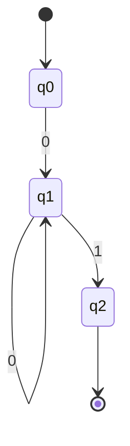
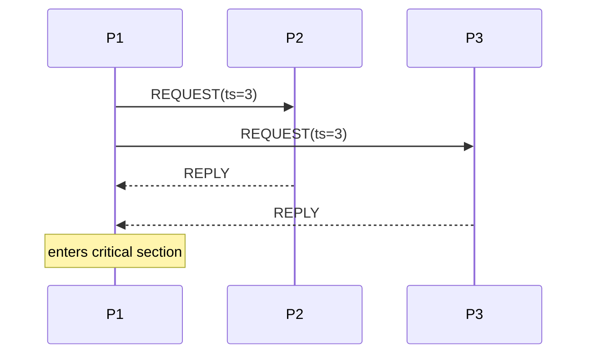
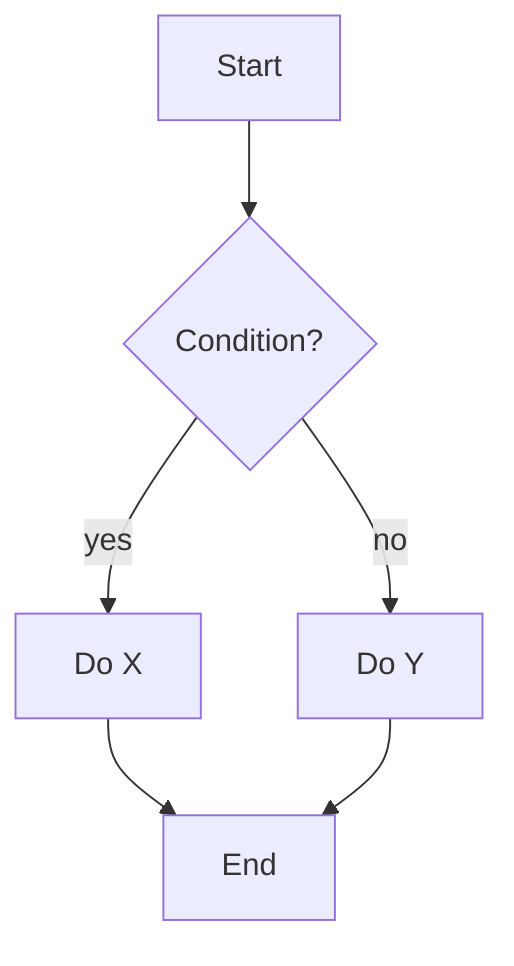
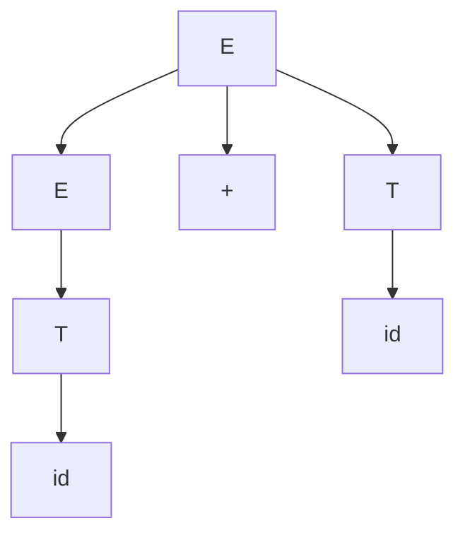
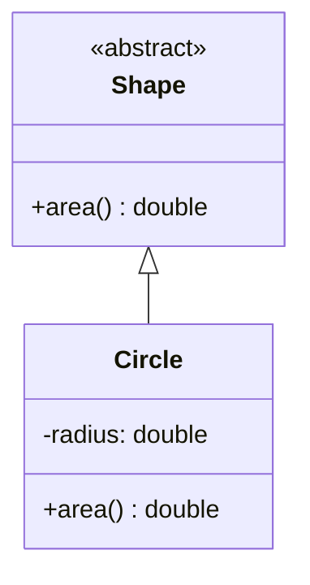
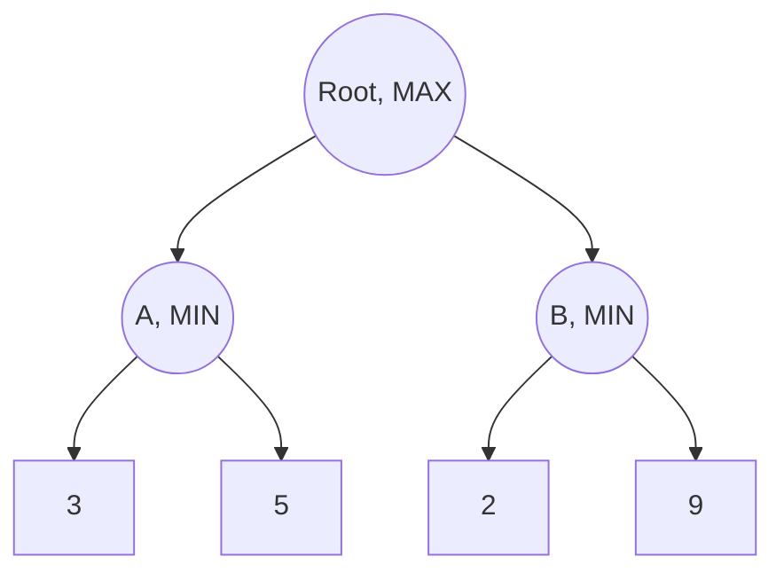

## What I do

I keep diagrams consistent and give a ready template per diagram type so
course agents don't have to invent Mermaid syntax from scratch each time.

## When to use me

Any time a topic is fundamentally about states, transitions, message flow,
tree structure, or class relationships — these render natively in Markdown
viewers/OpenCode and are far clearer than a paragraph describing the same
thing.

## Automata / Turing machines (Computability Theory)

## Message passing / distributed algorithms (Parallel & Distributed)

## Algorithm flow / decision procedures (any course)

## Parse trees / derivations (Syntax & Semantics)

## Class relationships (OOP in C++)

## Search / game trees (AI)

## Rules

- Keep diagrams small and single-purpose — one diagram per concept, not one
  giant diagram trying to show a whole lecture.
- Always caption a diagram with a one-line sentence explaining what to read
  off of it.
- For automata, label every transition with its input symbol; for sequence
  diagrams, label every message with what it actually carries (not just
  "message 1").
- If a diagram is a direct redraw of a slide figure, note that in the caption
  ("redrawn from slide 7") so the student can compare against the original.
