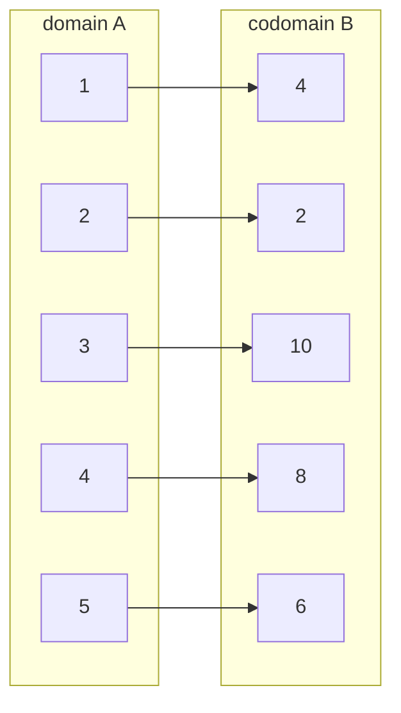
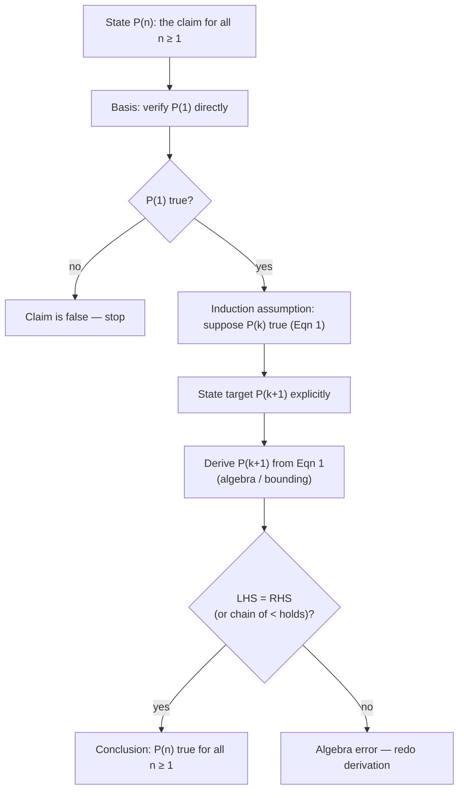

# Lecture 01 — Chapter I: Preliminaries (Sets, Functions, Predicates, Quantifiers, Induction)

## TL;DR
- This lecture is the **mathematical toolbox** for the whole course: sets and ordered
  n-tuples, functions (incl. injective/surjective/bijective), predicates, quantifiers,
  and mathematical induction — no automata or machines yet.
- A **predicate** is just a Boolean-valued function ($P: S \to \{0,1\}$ with
  $\text{TRUE}=1$, $\text{FALSE}=0$), and it corresponds *exactly* to a subset
  $R = \{a \in S \mid P(a)\}$ — this predicate↔subset dictionary is used constantly later.
- $\forall x\,P(x)$ is a **conjunction** over the domain (true only if *every* instance
  is true; one counterexample kills it); $\exists x\,P(x)$ is a **disjunction**
  (false only if *every* instance is false).
- Negating a quantifier flips it: $\lnot\forall x\,P(x) \Leftrightarrow \exists x\,\lnot P(x)$
  and $\lnot\exists x\,P(x) \Leftrightarrow \forall x\,\lnot P(x)$.
- **Mathematical induction** = prove $P(1)$ (basis) + prove $P(k) \Rightarrow P(k+1)$
  (inductive step); the assumption "$P(k)$ is true" is called the *induction assumption*.
- Sets are **unordered and duplicate-free**; tuples are **ordered** — hence
  $\{1,4,5\} = \{1,5,4\}$ but $(1,4,5) \neq (1,5,4)$, and generally $A \times B \neq B \times A$.

## Where this fits
This is the course's opening lecture: before the class can define a Turing machine, a
language, or a decision procedure, it needs the shared formal vocabulary — sets,
functions, logical predicates, quantified statements, and the one proof technique
(pumping-style arguments later are all *proofs by contradiction*, and virtually every
"for all inputs" theorem is proved by *induction*). Prerequisites: high-school algebra
and basic logic; nothing from earlier lectures exists yet. Note that the chapter
contents page lists 7 topics but this PDF only contains slides for 5 of them — see
[Full detailed explanation](#chapter-contents-vs-what-is-actually-covered) below.

## Learning objectives
After this lecture you should be able to:
- State the formal definitions of set, subset, empty set, ordered n-tuple, Cartesian
  product, function, injection, surjection, bijection, predicate, and both quantifiers —
  from memory, with correct symbols ($\in, \subseteq, \times, \forall, \exists$).
- Decide whether a given arrow-diagram or set-of-pairs is a function, and if so whether
  it is injective, surjective, bijective — by checking the *preimage counts*.
- Convert freely between a predicate $P$ and its truth-set $R=\{a\in S\mid P(a)\}$, and
  expand $\forall$/$\exists$ over a finite domain into $\land$/$\lor$ chains.
- Disprove a $\forall$-statement with a single counterexample, and prove an
  $\exists$-statement with a single witness.
- Write a complete, correctly structured induction proof (basis step, induction
  assumption, inductive step, algebra to close) — including for inequalities.

## Full detailed explanation

### Course framing (slide 1)
- **Intuition first**: administrative slide — course identity and how you are graded.
- **Formal statement**: Course **نظرية الحسابات / Theory of Computation, 203 Comp**,
  major: Computer Science (single track), **2 credit hours (theory)**.
  Grade distribution: **70** final written exam at end of semester, **25** coursework
  (أعمال فصليه), **5** oral (شفوي), total **100**.
- **Common pitfall**: the 5-point oral component is easy to forget when planning study
  time; it usually rewards being able to *speak* the definitions, not just recognize them.

### Course framing (slide 2) — "Computability, Complexity, and Languages"
Slide 2 is a unit-part title reading **"Computability, Complexity, and Languages"** —
this names the arc of the course: first what is *computable* at all (machines,
decidability), then *how hard* it is (complexity), all formalized as *languages* and
the machines that accept them. Nothing to memorize here; keep the three words as your
map of the semester.

### Chapter contents vs. what is actually covered
The contents slide (slide 3) lists:

1. Sets and n-tuples
2. Functions
3. Alphabets and Strings
4. Predicates
5. Quantifiers
6. Proof by Contradiction
7. Mathematical Induction

**The slides in this PDF cover items 1, 2, 4, 5, 7** — the section numbering on the
actual slides jumps from "2. Functions" straight to "3. Predicates" and "4. Quantifiers",
and **Alphabets and Strings** and **Proof by Contradiction** have no slides here.
*(This is flagged explicitly: the contents page and the slide numbering disagree —
check with the lecturer whether those two topics are coming in a later lecture or were
omitted. Alphabets/Strings in particular is essential for formal languages, so it
cannot be absent from the course entirely.)*

### Topic 1 — Sets and n-tuples (slides 4–10)

**Intuition first.** A set is a *bag of distinct objects where order doesn't matter*.
The moment order starts mattering (coordinates, strings, machine configurations), you
switch to **tuples**, which are ordered lists — and to **Cartesian products**, which
build "all possible ordered combinations" out of existing sets.

**Formal definitions.**

- **Set**: an unordered collection of distinct objects. Objects in a set are its
  **elements** or **members**.
- Notation for a set $A$:
  - $x \in A$ — "$x$ is an element of $A$"
  - $x \notin A$ — "$x$ is not an element of $A$"
  - Sets are denoted with **uppercase** letters ($A, B, \Sigma$), elements with
    **lowercase** letters ($a, b, x$). (This convention persists for the rest of the
    course: $\Sigma$ is a set of symbols, $w$ is a string.)
- **Empty set**: a set with no elements, denoted $\varnothing$. A set with exactly one
  element $\{a\}$ is a **singleton set**.
  - The slide's crucial warning: $\varnothing \neq \{\varnothing\}$. The left side has
    *no* elements; the right side is a singleton whose single element is *the empty set
    itself*.
- **Subset**: $A \subseteq B$ iff every element of $A$ is also an element of $B$:
  $$
  A \subseteq B \iff \forall x\,(x \in A \Rightarrow x \in B).
  $$
  Two facts the slides list as always true: $A \subseteq A$ and $\varnothing \subseteq A$
  for any set $A$ (vacuously — there is no element of $\varnothing$ that could violate
  the condition).
- **Set operations** (slide 6–7), in set-builder notation:
  $$
  \begin{aligned}
  A \cup B &= \{x \mid x \in A \lor x \in B\} &&\text{(union: in } A \text{ or } B \text{ or both)}\\
  A \cap B &= \{x \mid x \in A \land x \in B\} &&\text{(intersection: in both)}\\
  A - B &= \{x \mid x \in A \land x \notin B\} &&\text{(difference; also } A \setminus B\text{)}\\
  \overline{A} &= U - A = \{x \in U \mid x \notin A\} &&\text{(complement w.r.t. universal set } U\text{)}
  \end{aligned}
  $$
  The slide also notes $A - B = A - (A \cap B)$ (an equivalent way to read
  "in $A$ but not in $B$").

**Worked example (subset).** $A = \{1,2,3,4\}$, $B = \{1,3,4\}$, $C = \{4,5,6\}$.
- Is $B \subseteq A$? Check each element of $B$: $1\in A$ ✓, $3\in A$ ✓, $4\in A$ ✓.
  All pass, so $B \subseteq A$.
- Is $C \subseteq A$? $4 \in A$ ✓ but $5 \notin A$ ✗ — one failing element is enough,
  so $C \not\subseteq A$.
- If $A = \{2,4,17,23\}$ and $B = \{2,4,17,23\}$, then $A \subseteq B$, $B \subseteq A$,
  and therefore $A = B$ (equality of sets = mutual inclusion).

**Ordered n-tuples (slide 8).**
- **Ordered n-tuple** $(a_1, a_2, \dots, a_n)$: the ordered collection with $a_1$ first,
  $a_2$ second, …, $a_n$ last.
- Equality: $(a_1,\dots,a_n) = (b_1,\dots,b_n)$ iff $a_i = b_i$ for **every**
  $i = 1,\dots,n$ (position-by-position).
- An $n=2$ tuple is an **ordered pair**: $(3,5) \neq (5,3)$.
- **Parentheses vs braces**: round brackets $(\;)$ = order matters;
  curly braces $\{\;\}$ = order irrelevant. Hence $(1,4,5) \neq (1,5,4)$ while
  $\{1,4,5\} = \{1,5,4\}$.

**Cartesian product (slides 9–10).**
$$
A \times B = \{(a,b) \mid a \in A \land b \in B\}
$$
— the set of *all* ordered pairs mixing one element of $A$ with one of $B$.

- Example: $A = \{1,2,3\}$, $B = \{p,q\}$:
  $$
  A \times B = \{(1,p),(1,q),(2,p),(2,q),(3,p),(3,q)\} \quad (6 = 3\times 2 \text{ pairs}).
  $$
- Example: $K = \{a,b,c\}$, $L = \{1,2\}$:
  $$
  \begin{aligned}
  K \times L &= \{(a,1),(a,2),(b,1),(b,2),(c,1),(c,2)\},\\
  L \times K &= \{(1,a),(2,a),(1,b),(2,b),(1,c),(2,c)\}.
  \end{aligned}
  $$
  Clearly $K \times L \neq L \times K$ as sets (e.g. $(a,1) \in K\times L$ but
  $(a,1) \notin L \times K$).
- With a universal set $U$: $U \times U = \{(1,1),(1,2),(2,1),(2,2)\}$ (shown for
  $U=\{1,2\}$ on the slide).
- Slide claim (asserted, not proved): $A \times B \neq B \times A$ **unless**
  $A = \varnothing$ or $B = \varnothing$ or $A = B$. The slide turns this into an
  exercise: *"find an example to prove this."* *(The standard argument: if
  $A \neq B$ and both nonempty, WLOG there is $a \in A \setminus B$; pick any
  $b \in B$; then $(a,b) \in A\times B$ but $(a,b) \notin B\times A$ because
  $a \notin B$.)*
- **Powers of a set**: $A^2 = A \times A$, $A^n = \underbrace{A \times \cdots \times A}_{n}$,
  i.e.
  $$
  A^n = \{(a_1,\dots,a_n) \mid a_i \in A \text{ for } i=1,\dots,n\}.
  $$
  For $A = \{1,2\}$:
  $$
  \begin{aligned}
  A^2 &= \{(1,1),(1,2),(2,1),(2,2)\},\\
  A^3 &= \{(1,1,1),(1,1,2),(1,2,1),(1,2,2),(2,1,1),(2,1,2),(2,2,1),(2,2,2)\}.
  \end{aligned}
  $$
  $\{0,1\}^2 = \{(0,0),(0,1),(1,0),(1,1)\}$, and a typical element of $\{0,1\}^6$ is
  $(0,1,1,1,0,1)$ — **think of $\{0,1\}^n$ as the set of all binary strings of length
  $n$**. This is the seed of the course's central idea: *languages are sets of strings,
  strings are tuples over an alphabet*.
- **n-fold product of different sets**:
  $$
  A_1 \times A_2 \times \cdots \times A_n = \{(a_1,\dots,a_n) \mid a_i \in A_i\}.
  $$
  Car registration plate example: a plate like `KCT454` is the ordered 6-tuple
  $(K,T,C,4,5,4)$; if $L$ = all letters and $D$ = decimal digits, all possible plates
  form $L \times L \times L \times D \times D \times D$.

**Common pitfalls (topic 1)**
- Writing $A \subset B$ vs $\subseteq$: the slides use $\subset$ for subset (including
  possibly equal); be consistent and say which convention you use.
- Confusing $\varnothing$ with $\{\varnothing\}$ (empty vs. singleton-of-empty).
- Computing $A \times B$ but listing pairs in the wrong order, or forgetting that the
  count is $|A| \cdot |B|$.

### Topic 2 — Functions (slides 11–16)

**Intuition first.** A function is a *rule that assigns each input exactly one output*.
Two independent conditions, both required (the slides drill this with three
arrow-diagrams): (1) **every** input gets an output (no element of the domain may be
left out), and (2) each input gets **only one** output (no input fans out to two
outputs). Outputs may *repeat* across different inputs — that's allowed.

**Formal definition.** Given nonempty sets $A$ and $B$, a **function** $f$ from $A$ to
$B$ is an assignment of **exactly one** element of $B$ to each element of $A$. We write
$f(a) = b$ and $f : A \to B$. Functions are also called **mappings** or
**transformations**. As a set of pairs, $f$ is a set $f = \{(a,b)\} \subseteq A \times B$
satisfying the two conditions above — formally:
$$
\forall a \in A\ \exists! b \in B : (a,b) \in f,
$$
equivalently: $(a,b) \in f \land (a,c) \in f \Rightarrow b = c$.

*Redrawn from the slide-12 figure: the function $F = \{(1,4),(2,2),(3,10),(4,8),(5,6)\}$ —
every $x$ is used exactly once, so both conditions hold; note different $x$'s may share a $y$.*

**Worked examples from the slides (decide: is it a function?)**
1. $F = \{(1,4),(2,2),(3,10),(4,8),(5,6)\}$ — **yes**: all five $x$'s appear, and each
   $x$ appears in exactly one pair. The slide's remark: "each $x$ can have only one
   $y$, but it **can** be the same $y$ as another $x$ gets assigned to" — e.g. a pair
   like $(2,4)$ alongside $(1,4)$ would still be fine.
2. Diagram where **2 is assigned both 4 and 10** — **not a function**: violates
   condition 2 (an $x$ maps to two different $y$'s). Formally
   $(2,4),(2,10) \in f$ but $4 \neq 10$.
3. Diagram where **3 doesn't get assigned to anything** — **not a function**: violates
   condition 1 (the domain element 3 has no image).

**Terminology (slide 14).** For $f : A \to B$ with $f(a) = b$:

| Term | Meaning |
|---|---|
| $\mathrm{dom}(f) = A$ | the **domain** (set of permitted inputs) |
| $B$ | the **codomain** (set outputs are drawn from) |
| $b$ | the **image** of $a$ |
| $a$ | the **preimage** (antecedent) of $b$ |
| $\mathrm{rng}(f) = \{f(a) \mid a \in A\}$ | the **range** (all actual images) |

The range sits inside the codomain: $\mathrm{rng}(f) \subseteq B$, and equality here is
exactly surjectivity (next).

**The three properties, in preimage-counting language (slides 15–16).**

- **Injection (one-to-one)**: $f(a) = f(b) \Rightarrow a = b$ for all $a,b$ in the
  domain. Plain reading: **every $b \in B$ has at most 1 preimage**.
  - *"injunction"* on the slide is a typo for *injection*.
- **Surjection (onto)**: $\forall b \in B\ \exists a \in A : f(a) = b$. Plain reading:
  **every $b \in B$ has at least 1 preimage** (equivalently, range = codomain).
- **Bijection (one-to-one correspondence)**: $f$ is **both** injective and surjective.
  Plain reading: **every $b \in B$ has exactly 1 preimage**.

**Worked example (classifying).** The slides use person→favorite-color style mapping
diagrams. Method: count preimages per codomain element.
- Every codomain element has ≤1 arrow in → injective. Some codomain element has 2+ → not.
- Every codomain element has ≥1 arrow in → surjective. Some codomain element has 0 → not.
- Exactly 1 arrow in, for every codomain element → bijective.
  A bijection therefore gives a perfect "pairing up" of $A$ and $B$ — the reason it's
  called a one-to-one *correspondence* (the slide's example pairs
  Anna–Carol, Mark–Jo, John–Martha, Paul–Dawn, Sarah–Eve).

**Common pitfalls (topic 2)**
- Checking only condition 1 (all $x$ used) and missing condition 2 (one $x$, two $y$'s) —
  both slides-12 and 13 exist precisely to show each failure separately.
- Confusing codomain with range: surjectivity is about reaching the **codomain**, not
  about the range being small.
- "Injective" does **not** mean "different $x$ get different names of $y$ but some $y$
  unused is OK" — that's exactly injective-but-not-surjective; be able to say which.

### Topic 3 — Predicates (slides 17–18)

**Intuition first.** A predicate is a statement *with a free variable* that becomes
true or false once you plug in a concrete element. The lecture's move — worth
understanding deeply — is to treat truth as the number 1 and falsity as 0, so a
predicate becomes an honest-to-goodness function into $\{0,1\}$, and the set of
"inputs making it true" becomes an ordinary subset. Logic ↔ sets, back and forth.

**Formal definition.** A **predicate** is a Boolean-valued function on a set $S$: for
each $a \in S$, either $P(a) = \text{TRUE}$ or $P(a) = \text{FALSE}$. Identify
$$
\text{TRUE} = 1, \qquad \text{FALSE} = 0,
$$
so a predicate is a special kind of function with values in $\mathbb{N}$
(concretely, in $\{0,1\}$).

Predicates on $S$ are specified by expressions that become statements once their
variables are replaced by fixed elements of $S$. Example: the expression $x < 5$
specifies a predicate on $\mathbb{N}$:
$$
P(x) = \begin{cases} 1 & \text{if } x = 0,1,2,3,4,\\ 0 & \text{otherwise.} \end{cases}
$$

**Three basic operations on truth values**, from the slide's tables:

$$
\begin{array}{c|c}
p & \lnot p \\\hline
0 & 1\\
1 & 0
\end{array}
\qquad
\begin{array}{c|c|c|c}
p & q & p \land q & p \lor q \\\hline
1 & 1 & 1 & 1\\
0 & 1 & 0 & 1\\
1 & 0 & 0 & 1\\
0 & 0 & 0 & 0
\end{array}
$$
(transcribed from the slide image; $\land$ = AND, $\lor$ = OR, $\lnot$ = NOT).

**Predicate ↔ subset dictionary (the key equivalence of this topic):**

- Given predicate $P$ on $S$, the corresponding **truth-set** is
  $$
  R = \{a \in S \mid P(a)\} \quad (\text{i.e. } P(a) = 1).
  $$
- Conversely, given $R \subseteq S$, the expression $x \in R$ defines the predicate
  $$
  P(x) = \begin{cases} 1 & \text{if } x \in R,\\ 0 & \text{if } x \notin R.\end{cases}
  $$
- Example both ways: $x < 5$ on $\mathbb{N}$ ↔ $R = \{0,1,2,3,4\}$.
- Two expressions define the **same predicate** when we place $\equiv$ between them
  (the slide's symbol is dropped by text extraction; $\equiv$ is the standard
  "logically identical" marker here). Thus
  $$
  x < 5 \;\equiv\; x=0 \lor x=1 \lor x=2 \lor x=3 \lor x=4 .
  $$

**Why this matters for the course**: "the set of strings $w$ such that property $P(w)$
holds" is *literally* this construction — a language is the truth-set of a predicate on
strings. Keep the dictionary fluent.

**Common pitfalls**: writing $P(x) = 1$ "if $x < 5$, else 0" over a domain that isn't
$\mathbb{N}$ (the piecewise definition depends on the domain!); and forgetting that
$\equiv$ means same truth-value for *every* input, not "similar".

### Topic 4 — Quantifiers (slides 19–21)

**Intuition first.** $\forall$ and $\exists$ turn a predicate (a statement per element)
into a single yes/no claim about the whole domain. $\forall$ = "and-chain" (fragile:
one counterexample destroys it); $\exists$ = "or-chain" (fragile in reverse: one
witness saves it).

**Formal definitions.**
- **Universal quantification** of $P(x)$: the statement *"$P(x)$ for all values of $x$
  in the domain"*, written $\forall x\, P(x)$, read "for all $x$, $P(x)$" / "for every
  $x$, $P(x)$". An element with $P(x)$ false is a **counterexample** of $\forall x P(x)$.
- **Existential quantification** of $P(x)$: the statement *"there exists an $x$ with
  $P(x)$ true"*, written $\exists x\, P(x)$. An element with $P(x)$ true is a
  **witness**.

**Truth table for quantified statements (slide's Table I):**

| Statement | True when | False when |
|---|---|---|
| $\forall x\,P(x)$ | $P(x)$ is true for every $x$ | there is an $x$ for which $P(x)$ is false |
| $\exists x\,P(x)$ | there is an $x$ for which $P(x)$ is true | $P(x)$ is false for every $x$ |

**Universal examples (slide 19).**
1. Domain = all reals, $P(x): x+1 > x$. $\forall x\,P(x)$ is **true** — true for every
   real $x$ (subtract $x$: this reads $1 > 0$).
2. Domain = all reals, $Q(x): x < 2$. $\forall x\,Q(x)$ is **false** — take $x = 3$;
   $Q(3)$ is false, so $x=3$ is a **counterexample**. (One is enough!)

**Finite domains expand into conjunctions.** If $U = \{x_1,\dots,x_n\}$:
$$
\forall x\,P(x) \;\Leftrightarrow\; P(x_1) \land P(x_2) \land \cdots \land P(x_n),
$$
true iff every instance is true. Worked example, $P(x): x^2 < 10$:

- Domain = positive integers $\le 3$, i.e. $\{1,2,3\}$:
  $$
  \underbrace{1^2 < 10}_{1<10\ \text{T}} \land \underbrace{2^2 < 10}_{4<10\ \text{T}} \land \underbrace{3^2 < 10}_{9<10\ \text{T}} = T \land T \land T = \mathbf{T}.
  $$
  So $\forall x\,P(x)$ is **true** here.
- Domain = positive integers $\le 4$, i.e. $\{1,2,3,4\}$: append
  $4^2 < 10 \iff 16 < 10$ which is **F**, so
  $T \land T \land T \land F = \mathbf{F}$ — **false**, and $x = 4$ is the
  counterexample.

**Existential examples (slide 20).**
1. Domain = all reals, $P(x): x > 3$. $\exists x\,P(x)$ is **true** — witness $x = 4$.
2. Domain = all reals, $Q(x): x = x+1$. $\exists x\,Q(x)$ is **false** — false for
   *every* real $x$ (subtract $x$: $0 = 1$).

**Finite domains expand into disjunctions.** If $U = \{x_1,\dots,x_n\}$:
$$
\exists x\,P(x) \;\Leftrightarrow\; P(x_1) \lor P(x_2) \lor \cdots \lor P(x_n).
$$
Worked example, same $P(x): x^2 < 10$, domain $\{1,2,3,4\}$:
$$
T \lor T \lor T \lor F = \mathbf{T} \quad\text{— true (any one witness suffices).}
$$

**Negation of quantifiers (slide 21).** Distributing negation flips the quantifier:
$$
\lnot \forall x\, P(x) \;\Leftrightarrow\; \exists x\, \lnot P(x),
\qquad
\lnot \exists x\, P(x) \;\Leftrightarrow\; \forall x\, \lnot P(x).
$$
*(The slide asserts these without proof — the standard argument: "not everything has
property $P$" means "something lacks $P$," and "nothing has property $P$" means
"everything lacks $P$." Try it on $P(x): x < 2$ over the reals: $\lnot\forall x(x<2)$
is witnessed by $x=3$, i.e. $\exists x(x\ge 2)$.)*

**Common pitfalls**
- Proving $\forall$ by example (you can't) / disproving $\forall$ with one
  counterexample (you can). Dually for $\exists$.
- Losing track of the **domain**: $\forall x(x+1>x)$ is true over $\mathbb{R}$ and over
  $\mathbb{N}$, but a statement's truth value is meaningless until the domain is fixed.
- The finite-domain expansions swap roles: $\forall \to \land$, $\exists \to \lor$ —
  mixing them up is the classic exam slip.

### Topic 5 — Mathematical Induction (slides 22–24)

**Intuition first.** You want to prove a statement $P(n)$ for *infinitely many* $n$ but
can only check finitely many directly. Induction is the domino argument: knock down the
first domino ($P(1)$), and show each domino knocks over the next
($P(k) \Rightarrow P(k+1)$); then all fall. The "assumption $P(k)$" is a *hypothesis for
the sake of the argument*, not circular reasoning — you use it only to prove
$P(k+1)$, and the basis step anchors the chain.

**Formal statement (Principle of Mathematical Induction).** To prove $P(n)$ is true for
all positive integers $n$, where $P(n)$ is a propositional function, complete two steps:

- **Basis step**: verify $P(1)$ is true.
- **Inductive step**: show the conditional $P(k) \Rightarrow P(k+1)$ is true for all
  positive integers $k$ — i.e. assuming "$P(k)$ is true" (the **induction assumption**),
  prove $P(k+1)$ is true.

*(The slide states the principle without justification; the underlying reason is the
well-ordering principle — if the set of counterexamples were nonempty it would have a
least element, and basis + inductive step show no element can be a counterexample.)*

**Worked Example 1 — sum of the first $n$ integers (slide 22).**
Claim: $P(n): 1 + 2 + \cdots + n = \dfrac{n(n+1)}{2}$ for every positive integer $n$.

*Basis step* ($n = 1$):
$$
\text{LHS} = 1, \qquad \text{RHS} = \frac{1(1+1)}{2} = \frac{1 \cdot 2}{2} = 1.
$$
LHS = RHS, so $P(1)$ is true.

*Inductive step*: assume $P(k)$ — the **induction assumption**, labelled *Eqn 1* on
the slide:
$$
1 + 2 + \cdots + k = \frac{k(k+1)}{2}. \tag{1}
$$
Must show $P(k+1)$:
$$
1 + 2 + \cdots + k + (k+1) = \frac{(k+1)(k+2)}{2}.
$$
Add $k+1$ to both sides of (1):
$$
\begin{aligned}
1 + 2 + \cdots + k + (k+1) &= \frac{k(k+1)}{2} + (k+1)\\[2pt]
&= \frac{k(k+1) + 2(k+1)}{2} &&\text{(common denominator)}\\[2pt]
&= \frac{(k+1)(k + 2)}{2} &&\text{(factor out } (k+1)\text{)}\\[2pt]
&= \text{RHS of } P(k+1).
\end{aligned}
$$
Expanding both numerators confirms them equal:
$k^2 + k + 2k + 2 = k^2 + 3k + 2 = k^2 + 2k + k + 2$.
LHS = RHS; $P(k+1)$ holds under the assumption, so by induction $P(n)$ is true for all
positive integers $n$. ∎

**Worked Example 2 — sum of the first $n$ odd integers (slide 23).**
Claim: $P(n): 1 + 3 + 5 + \cdots + (2n-1) = n^2$.

*Basis step* ($n=1$): LHS $= 1$ (the first odd integer, $2\cdot1-1 = 1$);
RHS $= 1^2 = 1$. Equal ✓.

*Inductive step*: assume $P(k)$:
$$
1 + 3 + 5 + \cdots + (2k-1) = k^2. \tag{1}
$$
Must show $P(k+1)$: $1 + 3 + \cdots + (2k-1) + \big(2(k+1)-1\big) = (k+1)^2$.
The next odd integer after $2k-1$ is $2(k+1)-1 = 2k+1$. Add it to both sides of (1):
$$
\begin{aligned}
1 + 3 + \cdots + (2k-1) + \big(2(k+1)-1\big) &= k^2 + 2(k+1) - 1\\
&= k^2 + 2k + 2 - 1\\
&= k^2 + 2k + 1\\
&= (k+1)^2 .
\end{aligned}
$$
LHS = RHS ✓. By induction, $P(n)$ holds for all positive integers $n$. ∎
*(Transcribed from OCR of slide 23 — the algebra was reconstructed line-by-line from
the extracted text; it is the standard proof and checks out, but this page was not
among the visually re-verified images, so flag it if you compare against the PDF.)*

**Worked Example 3 — an inequality, $n < 2^n$ (slide 24).**
Claim: $P(n): n < 2^n$ for all positive integers $n$.

*Basis step*: $P(1): 1 < 2^1$, i.e. $1 < 2$ — TRUE.

*Inductive step*: assume $P(k): k < 2^k$; show $(k+1) < 2^{k+1}$.
1. Add 1 to both sides of the assumption (legit — same operation on both sides):
   $$
   k + 1 < 2^k + 1.
   $$
2. Since $k \ge 1$, we have $1 \le 2^k$, so:
   $$
   k + 1 < 2^k + 1 \le 2^k + 2^k = 2 \cdot 2^k = 2^{k+1}.
   $$
   Chaining: $k+1 < 2^{k+1}$. ✓ (This is $P(k+1)$.)

By induction, $n < 2^n$ for all positive integers $n$. ∎
*(Why this example matters: equality-based proofs let you massage both sides until
they match; inequality proofs can only **bound** — the structure "assume, add an
introduce the $k+1$ term, then over-estimate it into shape" is the template you'll reuse.)*

**Proof structure at a glance**

*Read off: a complete induction proof has exactly four named parts — statement,
basis, assumption, inductive step — and the exam rubric awards credit per part.*

**Common pitfalls (topic 5)**
- Forgetting to **state $P(k+1)$ explicitly** before deriving it — the reader/examiner
  can't tell what you're proving.
- Using $P(k+1)$ (or worse, the conclusion) inside the proof of $P(k+1)$ — circular.
  The assumption must be $P(k)$ only.
- Basis step checked at the wrong starting point: always match the claim's stated
  domain. The slides' claims run over the **positive integers**, so the basis is
  $n = 1$, not $n = 0$ — a claim phrased "for all $n \ge 0$" would need $P(0)$ instead.
- In inequality proofs, writing "$<$" where only "$\le$" was justified (the slide's
  chain $2^k + 1 \le 2^k + 2^k$ uses $\le$, correctly — the final strict $<$ comes from
  the first link $k+1 < 2^k+1$).

## Key definitions & theorems

| Term | Precise statement | Plain-English meaning |
|---|---|---|
| Set | unordered collection of distinct objects | a bag of unique items, order-free |
| $A \subseteq B$ | $\forall x(x \in A \Rightarrow x \in B)$ | everything in $A$ is in $B$ |
| $\varnothing$ | the set with no elements | empty; note $\varnothing \neq \{\varnothing\}$ |
| $A \cup B / A \cap B / A - B / \overline{A}$ | $\{x \mid x\in A \lor x \in B\}$ / $\{x \mid x\in A \land x \in B\}$ / $\{x \mid x\in A \land x \notin B\}$ / $U - A$ | or / and / but-not / not |
| Ordered n-tuple | $(a_1,\dots,a_n)$, equal iff all positions equal | order matters |
| $A \times B$ | $\{(a,b) \mid a \in A \land b \in B\}$ | all mixtures, one from each |
| $A^n$ | $\{(a_1,\dots,a_n) \mid a_i \in A\}$ | length-$n$ sequences over $A$; $\{0,1\}^n$ = binary strings of length $n$ |
| Function $f: A \to B$ | assigns exactly one element of $B$ to each element of $A$ | every input, exactly one output |
| Injection | $f(a)=f(b) \Rightarrow a=b$ (≤ 1 preimage per $b$) | no two inputs share an output |
| Surjection | $\forall b \in B\,\exists a \in A: f(a)=b$ (≥ 1 preimage per $b$) | every output is hit |
| Bijection | injective and surjective (exactly 1 preimage per $b$) | perfect pairing of $A$ and $B$ |
| Predicate | Boolean-valued function $P$ on $S$; TRUE=1, FALSE=0 | a statement-with-a-hole that is true or false per input |
| Truth-set of $P$ | $R = \{a \in S \mid P(a)\}$ | the subset where $P$ holds (logic ↔ sets) |
| $\forall x\,P(x)$ | $P$ true for every $x$ in the domain | false iff a counterexample exists |
| $\exists x\,P(x)$ | some $x$ in the domain with $P(x)$ true | true iff a witness exists |
| Negation laws | $\lnot\forall x P(x) \Leftrightarrow \exists x \lnot P(x)$; $\lnot\exists x P(x) \Leftrightarrow \forall x \lnot P(x)$ | negating flips the quantifier |
| Mathematical Induction | prove $P(1)$; prove $P(k) \Rightarrow P(k+1)$ | dominoes: base + cascade ⇒ all $n$ |

## Connections
- **→ Alphabets and Strings (listed in contents, no slides here)**: $A^n$ and
  $\{0,1\}^n$ from this lecture are exactly "strings of length $n$"; a *language* will
  be a set of strings over an alphabet $\Sigma$ — i.e. a predicate's truth-set on
  $\Sigma^*$.
- **→ Proof by Contradiction (listed in contents, no slides here)**: the pumping
  lemma and the Halting-problem diagonalization in later units are both
  contradiction proofs; the quantifier-negation laws from this lecture are the tool
  used to open them ("assume $\forall$..., pick an arbitrary $x$...").
- **→ Decidability units**: a decider is a machine whose behavior defines a predicate
  "$M$ accepts $w$"; recognizability questions are $\forall/\exists$ statements over
  machines and inputs. Induction on machine computation (number of steps) is the
  standard proof shape.
- **→ Complexity units**: $A^n$-style counting reappears as input-size analysis;
  Big-O claims over "all $n$" are universally quantified and typically proved by
  induction or direct algebra.

## Quick self-check
1. Is $\varnothing = \{\varnothing\}$? Which side has an element?
   

Answer
No. $\varnothing$ has no elements; $\{\varnothing\}$
   is a singleton whose one element is the empty set. So $\varnothing \notin \varnothing$
   but $\varnothing \in \{\varnothing\}$.

2. Give a function that is injective but not surjective, with $A=\{1,2\}$, $B=\{1,2,3\}$.
   

Answer
$f = \{(1,1),(2,2)\}$. Every $b$ has **at most** 1
   preimage (injective), but $3$ has **none** (not surjective).

3. What is the truth-set of the predicate $P(x): x^2 < 10$ on $\{1,2,3,4,5\}$?
   

Answer
$\{1,2,3\}$ — since $1,4,9 < 10$ but
   $16, 25 \not< 10$.

4. Expand $\exists x\,P(x)$ over the domain $\{a,b,c\}$ and say when it is false.
   

Answer
$P(a) \lor P(b) \lor P(c)$; false only when all
   three are false.

5. In an induction proof, what may the induction assumption contain — $P(k)$, $P(k+1)$,
   or the final claim?
   

Answer
Only $P(k)$. Assuming $P(k+1)$ (or the conclusion)
   while proving $P(k+1)$ is circular reasoning.

6. Why does one counterexample disprove $\forall x\,P(x)$ but no finite amount of
   witnesses prove it (over an infinite domain)?
   

Answer
$\forall x P(x) \Leftrightarrow \bigwedge_{x} P(x)$
   over the whole domain — a single false conjunct makes the chain false; the chain has
   infinitely many conjuncts, so confirming them all requires an argument (e.g. an
   inductive/general proof), not spot checks.

## One-page cheat-sheet
- **Set**: unordered, distinct. $\in, \notin, \subseteq$ ($A\subseteq B \iff
  \forall x(x\in A \to x\in B)$); $\varnothing \neq \{\varnothing\}$; $A\subseteq A$,
  $\varnothing\subseteq A$.
- **Operations**: $A\cup B=\{x\mid x\in A \lor x\in B\}$,
  $A\cap B=\{x\mid x\in A \land x\in B\}$,
  $A-B=\{x\mid x\in A \land x\notin B\}$,
  $\overline A = U-A$.
- **Tuples/products**: order matters in $(\ )$, not in $\{\ \}$;
  $A\times B=\{(a,b)\mid a\in A, b\in B\}$, $|A\times B| = |A||B|$,
  $A\times B \neq B\times A$ (unless $A=B$ or one is empty);
  $A^n$ = length-$n$ tuples; $\{0,1\}^n$ = binary strings of length $n$.
- **Function**: exactly one output per input, all inputs used. Injective = ≤1 preimage;
  surjective = ≥1 preimage; bijective = exactly 1 preimage. $\mathrm{rng}(f)\subseteq B$;
  surjective $\iff \mathrm{rng}(f) = B$.
- **Predicate**: $P:S\to\{0,1\}$, TRUE=1, FALSE=0; truth-set $R=\{a\in S\mid P(a)\}$;
  same predicate $\Leftrightarrow$ written with $\equiv$.
- **Quantifiers**: $\forall \to$ conjunction (kill with 1 counterexample);
  $\exists \to$ disjunction (save with 1 witness);
  $\lnot\forall \Leftrightarrow \exists\lnot$, $\lnot\exists \Leftrightarrow \forall\lnot$.
  Finite domain $\{x_1..x_n\}$: $\forall x P(x) \Leftrightarrow \bigwedge_i P(x_i)$,
  $\exists x P(x) \Leftrightarrow \bigvee_i P(x_i)$.
- **Induction**: (1) state $P(n)$; (2) basis $P(1)$; (3) assume $P(k)$ (Eqn 1);
  (4) state target $P(k+1)$; (5) derive it from Eqn 1; (6) conclude $\forall n \ge 1$.

## Source reference

| Section of these notes | PDF pages |
|---|---|
| Course/admin framing | 1–2 |
| Chapter contents | 3 |
| Sets, empty set, subset | 4–5 |
| Set operations (union, intersection, difference, complement) | 6–7 |
| Ordered n-tuples | 8 |
| Cartesian product + examples | 9 |
| $A^n$, $\{0,1\}^n$, n-fold products | 10 |
| Function definition + mapping diagrams | 11–13 |
| Domain/codomain/image/preimage/range | 14 |
| Injection, surjection | 15 |
| Bijection | 16 |
| Predicates + truth tables + predicate↔subset | 17–18 |
| Universal quantifier + examples + finite $\land$-expansion | 19 |
| Existential quantifier + examples | 20 |
| Finite $\lor$-expansion + negation of quantifiers | 21 |
| Induction principle + Example 1 ($n(n+1)/2$) | 22 |
| Example 2 (sum of odds $= n^2$) | 23 |
| Example 3 ($n < 2^n$) | 24 |

*Extraction notes: the PDF has a partial text layer (title, predicates, quantifier
headers); most pages were recovered by OCR at 300 dpi and every formula-bearing page
was cross-checked against the rendered image (truth tables p.17, quantifier/negation
p.19 & 21, induction principle + Example 1 p.22, Example 3 p.24, sets p.04 visually
confirmed). Slide 23's Example 2 was verified against OCR text + independent
reconstruction rather than a confirmed image. OCR typos corrected above: "injunction" →
injection; "$x? < 10$" → $x^2 < 10$; "$W x$" → $\forall x$; "$4x$" → $\exists x$.*
