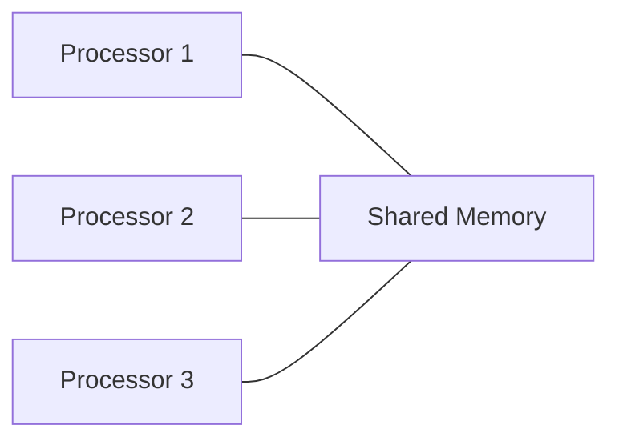
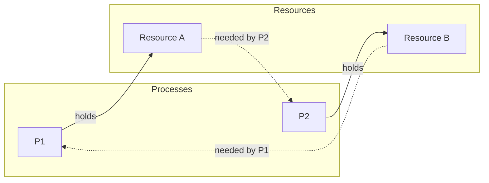
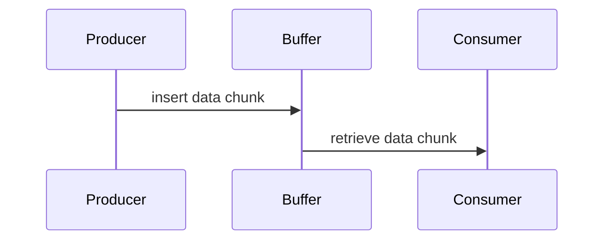

# Lecture 01 — Introduction and Basic Concepts

## TL;DR

- A **sequential program** is a single instruction stream executed by one processor; a **parallel program** decomposes a problem into concurrent tasks across multiple processors.
- **Shared-memory** systems give all processors a global address space; **distributed-memory** systems give each processor private memory and connect them via a network — this is the course's central axis.
- **Correctness** for concurrent programs requires three properties beyond input-output correctness: **mutual exclusion** (only one process in its critical section at a time), **deadlock freedom** (no permanent blocking), and **liveness** (every requesting process eventually gets the resource).
- **Semaphores** — a compound data structure of a nonnegative integer and a queue — solve the critical-section problem and the producer-consumer problem when operations `wait` and `signal` are atomic.
- The **producer-consumer problem** demonstrates condition synchronization: the consumer must be blocked when the buffer is empty, and unblocked by the producer when data arrives.

## Where this fits

This is the opening lecture of COMP 403. It establishes the vocabulary and foundational problems (critical section, deadlock, producer-consumer) that every subsequent lecture builds on. No prerequisite beyond basic programming.

## Learning objectives

After this lecture you should be able to:

1. Distinguish between a sequential program, a sequential process, and a concurrent execution.
2. Explain the difference between shared-memory and distributed-memory architectures.
3. State the three correctness properties for concurrent programs (mutual exclusion, deadlock freedom, liveness) and give a counterexample for each if violated.
4. Define a semaphore and explain the atomicity requirement on `wait` and `signal`.
5. Solve the critical-section problem for two tasks and for $n$ tasks using a binary semaphore.
6. Solve the producer-consumer problem with an unbounded buffer using a general semaphore and explain why the consumer blocks on an empty buffer.

---

## Full Detailed Explanation

### 1. Sequential Program (SP)

**Intuition.** A sequential program is the simplest computation model: one instruction stream, one processor, data goes in, results come out.

**Formal definition.** A sequential program $S$ is a finite sequence of instructions that transforms input data satisfying a precondition $p$ into output data satisfying a postcondition $q$. Correctness is expressed as a Hoare triple:

$$\{p\}\; S\; \{q\}$$

where $p$ is the precondition (state of memory before execution) and $q$ is the postcondition (desired state after execution).

**Correctness has two levels:**

| Level | Definition |
|---|---|
| **Partial correctness** | For every *terminating* execution of $S$ with input satisfying $p$, the output satisfies $q$. |
| **Total correctness** | Partially correct *and* every execution with input satisfying $p$ terminates. |

Partial correctness does not consider termination — a program that loops forever but never produces wrong output is partially correct.

**Worked examples:**

- $\{x > 0\}\; x := x * 2\; \{x \text{ is even}\}$ — **correct**. If $x > 0$ initially, doubling it always produces an even number.
- $\{x = 5\}\; x := x + 4\; \{x = 10\}$ — **incorrect**. $5 + 4 = 9 \neq 10$.
- $\{k = 5\}\; k := k + 1\; \{k = 6\}$ — **correct**. $5 + 1 = 6$.

### 2. Why Parallel Computing?

Two motivations:

1. **Speedup** — solve complex problems faster by splitting work across processors.
2. **Scale** — solve problems too large for a single machine by partitioning them into pieces that run concurrently.

The entire course revolves around quantifying motivation (1) via speedup, efficiency, and Amdahl's law, and realizing motivation (2) via distributed algorithms.

### 3. Sequential Process

A single task is performed as a **sequential process**: an ordered sequence of operations $o_1, o_2, o_3, \dots$

Key properties:
- The next operation begins only after the previous one completes (no overlap within a single process).
- A sequential process results from executing a single instruction sequence.

This is important because a parallel program is composed of multiple sequential processes — each one is internally sequential, but they run *simultaneously* with respect to each other.

### 4. Synchronous vs. Asynchronous Execution

| Model | Behaviour |
|---|---|
| **Synchronous** | The caller waits for each operation to finish before proceeding. This forces a sequential order of execution. |
| **Asynchronous** | Operations are not synchronised in time — executions can interleave or overlap. No waiting between processes. |

**Concurrent processes** are sequential processes performed simultaneously and asynchronously: each process is sequential internally, but operations of different processes can occur in any relative order.

This distinction matters because asynchrony introduces the race conditions and critical-section problems that the rest of the lecture addresses.

### 5. Communication Between Processes

#### Shared Memory

All processors share a single global address space. Any processor can read/write any memory location.



*Caption: In a shared-memory system, all processors access the same memory space.*

**Advantages:** fast communication (just a memory read/write), natural for threads on the same machine.

**Challenges:** synchronisation is the programmer's responsibility — this is exactly the critical-section problem.

#### Distributed Memory (Message Passing)

Each processor has its own private local memory. Memory addresses in one processor do not map to another. Processors communicate by sending and receiving messages over a network.


*Caption: In a distributed-memory system, processors communicate only via message passing.*

**Key focus areas of distributed programs:**
- Sharing common resources and hardware.
- **Fault tolerance** — if some components fail, degradation should be minimal (fail-stop assumption is standard; Byzantine failure is a stronger model discussed later in the course).

> **This distinction — shared memory vs. message passing — is the course's central axis.** Every topic that follows (pthreads/OpenMP for shared memory, MPI for distributed memory) maps to one side of this divide.

### 6. Correctness of Concurrent Programs

For a sequential program, correctness is just $\{p\}\; S\; \{q\}$. For concurrent programs, each individual task (sequential program) must be correct, **plus** additional global properties must hold:

1. **Safety properties** — "nothing bad happens":
   - Mutual exclusion.
   - Freedom from deadlock.

2. **Liveness properties** — "something good eventually happens":
   - Every requesting process eventually gets the resource (no starvation).

### 7. Safety Properties

#### 7.1 Mutual Exclusion

**Definition:** At any time, no resource is used by more than one process.

Concurrent processes often compete for shared resources: shared-memory variables, files, disk storage, I/O devices. Mutual exclusion guarantees that only one process is in its critical section at any moment.

#### 7.2 Freedom from Deadlock

**Definition:** Processes cannot end up permanently blocked, each waiting on the other.

**Classic deadlock example:**



*Caption: Deadlock — P1 holds A and needs B; P2 holds B and needs A. Neither can proceed.*

**Scenario:** P1 and P2 each need both resources A and B. If P1 gets A and P2 gets B, then P1 waits for B (held by P2) and P2 waits for A (held by P1) — permanent blocking, i.e. deadlock.

### 8. Liveness Property

**Definition:** During each concurrent implementation of a program, a required condition will be satisfied at some point.

**Example — competing for a printer:** If any process issues a print request, then at some point it will be assigned the printer.

**Consequence:** No individual starvation — no process is left waiting forever because the resource is never allocated to it.

### 9. The Critical Section Problem

**Definition:** Occurs when a group of processes compete for a resource where, at any given time, only one process can have access.

**Resources that cause this problem:** shared-memory variables, database records, files, physical devices (printers, disks).

**Critical section:** The fragment of a process (or task) in which it makes use of the resource.

**Requirement:** At any time, only one task executes its critical section.

#### Solution Approach

To enter the critical section, a task must:
1. **Acquire** permission — the resource must be assigned to it.
2. **Use** the resource in its critical section.
3. **Release** the resource after completing the section.

If T₂ requests the resource while T₁ is using it, T₂ must wait until T₁ releases it.

This solution is implemented using **semaphores** (next section).

### 10. Semaphores

#### Definition

A **semaphore** $s$ is a compound data structure with two fields:

$$s = (w,\; q)$$

where:
- $s.w$ — a nonnegative integer (the "weight" or "value").
- $s.q$ — a set (queue) of tasks (processes) blocked on this semaphore.

In pseudocode:

```
type semaphore is
  record
    w: natural;
    q: queue;
  end record;
```

**Initialisation:** $s := (0, \emptyset)$ or $s := (1, \emptyset)$ depending on the use case.

#### Two Types

| Type | $s.w$ range | Use case |
|---|---|---|
| **General semaphore** | Any nonnegative integer | Counting / condition synchronisation |
| **Binary semaphore** | Only 0 or 1 | Mutual exclusion (1 = free, 0 = used) |

#### Operations

**`wait(s)`** — atomic operation:
```
if s.w > 0 then
    s.w := s.w - 1        -- decrement and proceed
else
    suspend the task       -- block the task
    add it to s.q          -- enqueue it
```

**`signal(s)`** — atomic operation:
```
if s.q is nonempty then
    remove one task from s.q   -- unblock it
    resume its execution
else
    s.w := s.w + 1            -- increment
```

> **Critical requirement:** `wait` and `signal` are **atomic** — their internal actions cannot be interleaved with any other instructions. This is what makes semaphores correct; without atomicity, two tasks could both read $s.w > 0$ before either decrements, violating mutual exclusion.

> The set of blocked tasks $s.q$ is organised as a **FIFO queue** — the first task blocked is the first to be unblocked (fairness).

#### What Goes Wrong Without Semaphores

Without a synchronisation primitive, two tasks could simultaneously check "is the resource free?", both see "yes", and both enter the critical section — violating mutual exclusion. This is a **race condition**: the outcome depends on the unpredictable timing of interleaved instructions.

### 11. Solving the Critical Section Problem (Two Tasks)

Using a **binary semaphore** $s$ initialised to $(1, \emptyset)$ (meaning the resource is free):

```
-- Task T1                          -- Task T2
wait(s)                             wait(s)
  critical section                    critical section
signal(s)                           signal(s)
```

#### Proof of Mutual Exclusion

Suppose T₁ and T₂ both want to enter simultaneously:

1. Both perform `wait(s)`.
2. Since `wait(s)` is atomic, only one of them can observe $s.w = 1$ and decrement it to 0. The other observes $s.w = 0$ and is blocked (added to $s.q$).
3. Therefore at most one task is in its critical section at any time. ∎

#### Proof of Deadlock Freedom

Claim: The solution is free of deadlock.

**Proof by contradiction:**

1. Assume both T₁ and T₂ are blocked by `wait(s)`.
2. For a task to be blocked, `wait(s)` must have found $s.w = 0$ and added the task to $s.q$.
3. If both are blocked, $s.w = 0$ and $s.q$ contains both tasks.
4. But if $s.w = 0$, that means one task has already decremented from 1 to 0 — only one task could have been inside the critical section.
5. Contradiction: both cannot be blocked simultaneously. ∎

### 12. Critical Sections for $n$ Tasks

The same binary-semaphore pattern generalises to $n$ tasks:

```
-- Task Ti (i = 1, 2, ..., n)
wait(s)
  critical section
signal(s)
```

The proof of mutual exclusion and deadlock freedom extends unchanged: `wait(s)` is atomic, so exactly one task can transition $s.w$ from 1 to 0. All others are enqueued.

### 13. The Producer-Consumer Problem

**Setup:** A task called the **producer** generates data and passes it to another task called the **consumer**.



*Caption: Producer-consumer interaction via a buffer.*

Two communication models:

| Model | Behaviour |
|---|---|
| **Synchronous** | Producer sends directly to consumer; both must be ready simultaneously. Idle time if one is faster. |
| **Asynchronous** | Uses a buffer; producer writes to buffer, consumer reads from buffer. Tasks operate independently. |

Asynchronous communication is preferred because it decouples the two tasks — the producer doesn't wait for the consumer, and vice versa, as long as average speeds align.

### 14. Solving Producer-Consumer with Unbounded Buffer

#### Data Structures

```
buffer: array(0 .. ∞) of data_type;   -- unbounded buffer
in, out: natural := 0;                -- buffer indices
nonempty: semaphore := (0, ∅);        -- general semaphore
```

- `nonempty.w` = number of data chunks currently in the buffer.
- `in` = index where the next produced item is written.
- `out` = index where the next consumed item is read.

#### Producer Task

```
task body Producer is
  data: data_type;
begin
  loop
    Produce data;
    buffer(in) := data;       -- insert data into the buffer
    in := in + 1;
    signal(nonempty);         -- signal that data is available
  end loop;
end Producer;
```

#### Consumer Task

```
task body Consumer is
  data: data_type;
begin
  loop
    wait(nonempty);           -- block if buffer is empty
    data := buffer(out);      -- retrieve data from the buffer
    out := out + 1;
    Consume data;
  end loop;
end Consumer;
```

#### Why the Consumer Blocks (Condition Synchronisation)

- **Case 1: `nonempty.w > 0`** — data is available. `wait(nonempty)` decrements $s.w$ by 1 and the consumer proceeds to read.
- **Case 2: `nonempty.w = 0`** — buffer is empty. The consumer is blocked (suspended, added to `nonempty.q`) until the producer calls `signal(nonempty)`.

The `signal(nonempty)` in the producer increments `nonempty.w` by 1. If a consumer is waiting in the queue, it is unblocked and resumes execution.

#### Semaphore `s` vs. Semaphore `nonempty` — Different Roles

| Aspect | Semaphore $s$ (critical section) | Semaphore `nonempty` (producer-consumer) |
|---|---|---|
| **Purpose** | Synchronises access to a shared resource | Signals data availability in the buffer |
| **Blocks when** | Resource is busy ($s.w = 0$) | Buffer is empty (`nonempty.w = 0`) |
| **Resumes when** | Resource becomes free (`signal` from holder) | Data are inserted (`signal` from producer) |

This distinction illustrates two uses of semaphores:

1. **Mutual exclusion** (binary semaphore, protecting a critical section).
2. **Condition/event synchronisation** (general semaphore, waiting for a specific state to become true).

Condition synchronisation is essential when a task can perform an operation correctly only if another task has already executed its operation, or if a specific event has occurred.

### 15. Problem with Unbounded Buffer

In practice, unbounded buffers are theoretical. If the producer is much faster than the consumer, the buffer grows without bound and memory overflows. A **bounded buffer** (of fixed size $N$) is the practical solution, requiring an additional semaphore `nonfull` to block the producer when the buffer is full — this is covered in later lectures.

---

## Key Definitions & Theorems

| Term | Precise statement | Plain-English meaning |
|---|---|---|
| **Sequential program** | A single instruction stream executed by one processor, transforming input to output. | One thing at a time, on one machine. |
| **Parallel program** | A decomposition of a problem into tasks (sequential programs) that may execute simultaneously on multiple processors. | Many things at once. |
| **Shared memory** | All processors access a global address space directly. | Everyone reads/writes the same RAM. |
| **Distributed memory** | Each processor has private memory; communication is via message passing over a network. | Separate machines talking over a network. |
| **Critical section** | The fragment of a process that uses a shared resource. | The part of code where you touch shared data. |
| **Mutual exclusion** | At most one process is in its critical section at any time. | Only one person in the bathroom at a time. |
| **Deadlock** | Two or more processes are permanently blocked, each waiting on the other. | Two people in a hallway, both refusing to step aside. |
| **Liveness** | Every requesting process eventually gets the resource. | No one waits forever. |
| **Semaphore** | A compound structure $(w, q)$ where $w$ is a nonnegative integer and $q$ is a FIFO queue of blocked tasks. | A synchronisation counter with a waiting line. |
| **Binary semaphore** | A semaphore where $w \in \{0, 1\}$. | A lock: free (1) or held (0). |
| **General semaphore** | A semaphore where $w$ is any nonnegative integer. | A counter: can track how many items are available. |
| **Condition synchronisation** | Using a semaphore to wait for a specific event/state rather than mutual exclusion. | "I'll wait until something happens." |
| **Producer-consumer problem** | Two tasks communicating via a buffer: producer generates data, consumer retrieves and processes it. | A pipeline: one makes, one uses. |

---

## Connections

- This lecture defines the vocabulary for **all** subsequent topics: shared vs. distributed memory → pthreads/OpenMP (shared) and MPI (distributed) in later lectures.
- The critical-section problem leads directly to Peterson's algorithm, test-and-set, and monitors (upcoming lectures on mutual exclusion algorithms).
- Deadlock is expanded into prevention, avoidance (Banker's algorithm), detection & recovery in later lectures.
- The semaphore solution here is the foundation for understanding monitors and condition variables.
- The producer-consumer problem reappears with bounded buffers, readers-writers, and dining philosophers.
- The Hoare triple $\{p\}\; S\; \{q\}$ connects to axiomatic semantics in the Syntax & Semantics course.

---

## Quick Self-Check

1. What is the difference between a sequential program and a sequential process?
<details>
A **sequential program** is a static instruction sequence (the code). A **sequential process** is the dynamic execution of that code — an ordered sequence of operations being carried out. A single program can be instantiated as multiple processes.
</details>

2. Why must `wait` and `signal` operations on a semaphore be atomic?
<details>
If they are not atomic, two tasks could simultaneously observe $s.w > 0$, both decrement it, and both enter the critical section — violating mutual exclusion. Atomicity ensures the check-and-update happens indivisibly.
</details>

3. What are the three correctness properties for concurrent programs?
<details>
**Mutual exclusion** (at most one process in the critical section), **deadlock freedom** (no permanent blocking), and **liveness** (every requesting process eventually gets the resource).
</details>

4. In the producer-consumer solution, what happens if the consumer calls `wait(nonempty)` when the buffer is empty?
<details>
The consumer is suspended (blocked) and added to the semaphore's queue `nonempty.q`. It remains blocked until the producer calls `signal(nonempty)`, which either increments `nonempty.w` or unblocks the consumer directly.
</details>

5. What is the difference between a binary semaphore and a general semaphore?
<details>
A **binary semaphore** has $w \in \{0, 1\}$ — used for mutual exclusion. A **general semaphore** has $w \in \mathbb{N}_0$ — used for counting or condition synchronisation (e.g., tracking how many items are in a buffer).
</details>

6. Why is partial correctness different from total correctness?
<details>
Partial correctness says: *if* the program terminates with valid input, the output is correct. Total correctness adds: the program *always* terminates. A program that loops forever but never produces wrong output is partially correct but not totally correct.
</details>

---

## One-Page Cheat-Sheet

| Concept | Formula / Definition |
|---|---|
| Hoare triple | $\{p\}\; S\; \{q\}$ |
| Semaphore | $s = (w, q)$ where $w \in \mathbb{N}_0$, $q$ = FIFO queue |
| Binary semaphore | $w \in \{0, 1\}$ |
| `wait(s)` | if $w > 0$: $w := w - 1$; else: block task, add to $q$ |
| `signal(s)` | if $q$ nonempty: unblock one task; else: $w := w + 1$ |
| Mutual exclusion | At most 1 task in critical section at any time |
| Deadlock | Two+ tasks permanently blocked, each waiting on the other |
| Liveness | Every requesting task eventually gets the resource |
| Producer-consumer | Producer: `produce → buffer(in)++ → signal(nonempty)` |
| | Consumer: `wait(nonempty) → buffer(out)++ → consume` |

---

## Source Reference

| Subsection | Slide/page |
|---|---|
| Course information & objectives | Slides 1–5 |
| Sequential Program | Slide 6–7 |
| Parallel Program | Slide 8–9 |
| Why Parallel Computing | Slide 10 |
| Sequential Process | Slide 11 |
| Synchronous / Asynchronous Execution | Slides 12–13 |
| Communication (shared vs. distributed) | Slides 14–16 |
| Correctness of sequential programs | Slides 17–19 |
| Correctness of concurrent programs | Slide 20 |
| Safety properties (mutual exclusion, deadlock) | Slides 21–23 |
| Deadlock example | Slide 24 |
| Liveness property | Slide 25 |
| Critical section problem | Slides 26–28 |
| Semaphores (definition, operations) | Slides 29–32 |
| Critical section solution (two tasks) | Slides 33–36 |
| Mutual exclusion & deadlock freedom proofs | Slides 37–38 |
| Critical sections for $n$ tasks | Slide 39 |
| Producer-consumer problem | Slides 40–42 |
| Unbounded buffer solution | Slides 43–45 |
| Semaphore roles comparison | Slide 46 |
| Condition synchronisation | Slide 47 |
